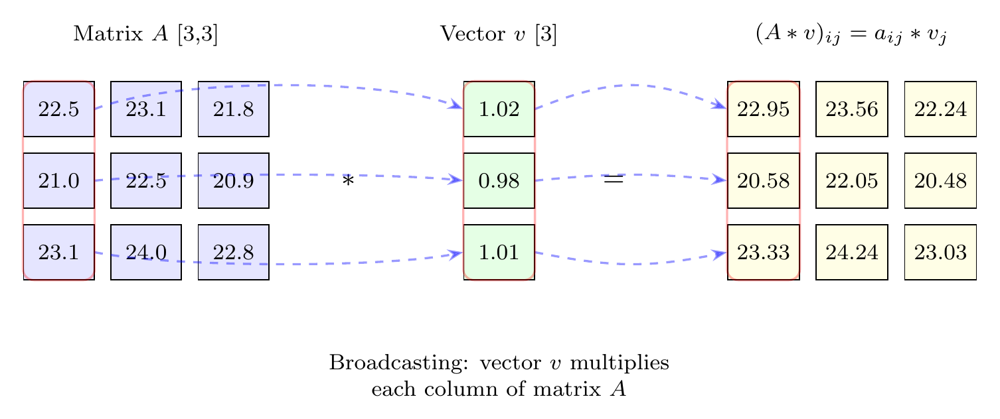
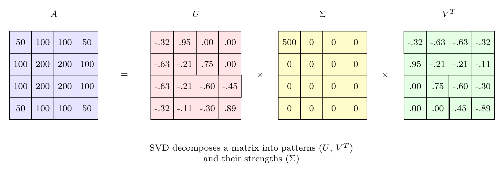

<br><br> <br><br> 

# STAT 4830: Numerical optimization for data science and ML
## Lecture 1: Basic Linear Algebra in PyTorch
### Professor Damek Davis

---

# Overview

Three key ideas drive PyTorch's design:
1. Tensors extend vectors and matrices to arbitrary dimensions
2. Memory layout and broadcasting optimize computation
3. SVD reveals low-dimensional structure in high-dimensional data

---

# Motivation: Temperature Analysis

In Lecture 0, we classified spam using word frequencies as vectors:
- Each email became a point in high-dimensional space
- Dimensions represented word counts
- Linear algebra revealed the underlying geometry

Now we'll explore PyTorch's efficient implementation through temperature data:
- Tensors for batch processing
- Memory-efficient operations
- Pattern discovery through SVD

---

# Outline

<div style="display: grid; grid-template-columns: 1fr 1fr 1fr; gap: 1em;">
<div>

1. Vectors and Tensors
```
Data → Tensors → Operations
```
- Efficient representation
- Hardware optimization
- Memory layout

</div>
<div>

2. Matrix Operations
```
Matrices → Broadcasting → BLAS
```
- Matrix algebra
- Memory reuse
- Performance

</div>
<div>

3. Finding Patterns
```
Data → SVD → Patterns
```
- Pattern discovery
- Dimension reduction
- Error bounds

</div>
</div>

---

# PyTorch Vector Operations

Basic operations:
```python
# Temperature readings (Celsius)
readings = torch.tensor([22.5, 23.1, 21.8])
print(readings)  # Morning, noon, night

# Vector operations
total = readings + 1.0  # Add to all
scaled = 2.0 * readings  # Scale all
norm = torch.norm(readings)  # Magnitude
```

Key features:
- Hardware acceleration
- Automatic memory management
- Efficient computation

---

# PyTorch Implementation Details

Implementation details:
```python
# Memory layout
print(readings.stride())  # (1,)
print(readings.storage())  # Contiguous

# Performance
%timeit readings + 1.0  # ~4ns
%timeit torch.norm(readings)  # ~12ns
%timeit readings * 2.0  # ~4ns
```

Memory efficiency:
- Contiguous storage
- Cache-friendly access
- Minimal overhead

---

# Vector Operations in Practice

<div style="display: grid; grid-template-columns: 1fr 1fr; gap: 1em;">
<div>

```python
# Compare temperatures
day1 = torch.tensor([22.5, 23.1, 21.8])
day2 = torch.tensor([21.0, 22.5, 20.9])

similarity = torch.dot(day1, day2)
mag1 = torch.norm(day1)
mag2 = torch.norm(day2)
diff = abs(mag1 - mag2) / mag1 * 100
```

</div>
<div>

Results:
- Similarity: 1447.9
- Day 1 magnitude: 38.9
- Day 2 magnitude: 37.2
- Difference: 4.6%

Key insight:
Similar daily patterns with
small temperature variation

</div>
</div>

---

# Memory Layout

<div style="display: grid; grid-template-columns: 1fr 1fr; gap: 2em;">
<div>

This layout affects performance:
```python
# Fast: accessing one day's readings
day_readings = week_temps[0]  # Row access

# Slower: accessing one time across days
morning_temps = week_temps[:, 0]  # Column

# Matrix multiply optimizes for this
result = torch.mm(week_temps, weights)
```

Understanding memory layout:
- Row operations are fast (contiguous)
- Column operations are slower (strided)
- Choose operations to match layout

</div>
<div style="text-align: center;">


Key insight:
Process data by rows when possible
(e.g., analyze one day at a time)

</div>
</div>

---

# Matrix Operations

Basic operations:
```python
# Week of temperature readings
week_temps = torch.tensor([
    [22.5, 23.1, 21.8],  # Monday
    [21.0, 22.5, 20.9],  # Tuesday
    [23.1, 24.0, 22.8]   # Wednesday
])

# Daily averages
means = week_temps.mean(dim=0)
print(means)  # [22.2, 23.2, 21.8]
```

---

# Matrix Operations: Mathematical View

<div style="display: grid; grid-template-columns: 1fr 1fr; gap: 1em;">
<div style="font-size: 0.9em;">

Mathematical form:
- Addition: $(A + B)_{ij} = a_{ij} + b_{ij}$
- Scaling: $(\alpha A)_{ij} = \alpha a_{ij}$
- Mean: $\text{mean}(A)_j = \frac{1}{m}\sum_{i=1}^m a_{ij}$
- Multiply: $(AB)_{ij} = \sum_{k} a_{ik}b_{kj}$

</div>
<div>

```python
# PyTorch equivalent
C = A + B         # Addition
C = alpha * A     # Scaling
m = A.mean(dim=0) # Row mean
C = A @ B         # Matrix multiply
```

</div>
</div>

Benefits:
- BLAS optimization
- Cache efficiency
- Parallel execution

---

# Broadcasting

<div style="display: grid; grid-template-columns: 1fr 1fr; gap: 1em;">
<div>

```python
# Original data: 2 days × 3 times
temps = torch.tensor([
    [22.5, 23.1, 21.8],  # Day 1
    [21.0, 22.5, 20.9]   # Day 2
])

# Calibration factors
calibration = torch.tensor(
    [1.02, 0.98, 1.01]
)

# Broadcasting: (2,3) * (3,)
calibrated = temps * calibration
```

</div>
<div>



Memory efficient:
- No copies needed
- Hardware optimized
- Automatic alignment

</div>
</div>

---

# Finding Patterns with SVD

<div style="display: grid; grid-template-columns: 1fr 1fr; gap: 2em;">
<div>

For matrix $A \in \mathbb{R}^{m \times n}$:

$$A = U\Sigma V^T = \sum_{i=1}^r \sigma_i u_i v_i^T$$

Properties:
1. $U^TU = I$, $V^TV = I$ (orthogonal)
2. $\sigma_1 \geq \sigma_2 \geq \cdots \geq 0$
3. $\text{rank}(A) = \#\{\sigma_i > 0\}$

</div>
<div style="text-align: center;">



Key components:
- $U$: Pattern combinations
- $\Sigma$: Pattern strengths
- $V^T$: Basic patterns

</div>
</div>

---

# Truncated Matrices and Low-Rank Approximation

For any rank $k \leq r$, we can truncate the SVD:

$$A_k = \sum_{i=1}^k \sigma_i u_i v_i^T$$

Properties:
- $A_k$ has rank exactly $k$
- Uses only first $k$ singular values/vectors
- Best rank-$k$ approximation to $A$
- Captures most important patterns

---

# Matrix Norms

The Frobenius norm measures matrix size:

$$\|A\|_F = \sqrt{\sum_{i,j} a_{ij}^2} = \sqrt{\sum_{i=1}^r \sigma_i^2}$$

Properties:
- Sum of squared entries
- Natural extension of vector length
- Computable from singular values
- Measures total energy in matrix

---

# Computing Frobenius Norm

Two equivalent implementations in PyTorch:
```python
# Method 1: As vector norm of flattened matrix
A = torch.tensor([[200, 50], [50, 200]])
norm1 = torch.norm(A.reshape(-1))  # Flatten to vector
print(norm1)  # 289.8

# Method 2: Using built-in Frobenius norm
norm2 = torch.norm(A, p='fro')
print(norm2)  # 289.8

# Verify they're equal
print(torch.allclose(norm1, norm2))  # True
```

---

# Eckart-Young-Mirsky Theorem

For any matrix $A$ and rank $k$:

$$\min_{\text{rank}(B) \leq k} \|A - B\|_F = \|A - A_k\|_F = \sqrt{\sum_{i=k+1}^r \sigma_i^2}$$

Key implications:
1. Truncated SVD gives optimal approximation
2. Error equals discarded singular values
3. Measured in Frobenius norm

---

# Eckart-Young-Mirsky: Example

For our checkerboard pattern:
```python
# Original singular values
print(S)  # [500, 300, ~0, ~0]

# Rank-1 approximation error
error = torch.sqrt(S[1:]**2).sum() / S.norm()
print(f"Error: {error:.1%}")  # 26.5%
```

The 26.5% error shows we need both components.

---

# SVD: Spam Classification

Feature extraction:
```python
def extract_features(email: str) -> torch.Tensor:
    return torch.tensor([
        len(re.findall(r'urgent|immediate', 
                      email.lower())),
        email.count('!'),
        len(re.findall(r'\$|\bdollars?\b', 
                      email.lower())),
        sum(1 for c in email if c.isupper()) 
            / len(email),
        len(email)
    ])
```

---

# SVD: Feature Analysis

Features measured:
1. Urgent/immediate words
2. Exclamation marks
3. Money references
4. CAPS ratio
5. Email length

Key insight:
- Each email becomes a point in 5D space
- Similar emails cluster together
- SVD reveals spam patterns

---

# SVD: Low-Rank Approximation Code

```python
def reconstruct(k):
    """Reconstruct using top k patterns."""
    return U[:, :k] @ torch.diag(S[:k]) @ V[:k, :]

# Compare reconstructions
original = X[0]  # First email features
rank1 = reconstruct(1)[0]  # Top pattern
rank2 = reconstruct(2)[0]  # Top two patterns

print("Original:", original)
print("Rank 1:", rank1)
print("Rank 2:", rank2)
```

---

# SVD: Error Analysis

Eckart-Young-Mirsky Theorem:
- Best rank-k approximation
- Error = discarded values

Error analysis:
```python
for k in range(1, 4):
    truncated = S[k:].norm(p=2)**2
    total = S.norm(p=2)**2
    error = torch.sqrt(truncated/total)
    print(f"Rank {k}: {error:.1%}")
# Rank 1: 13.5%
# Rank 2: 5.0%
# Rank 3: 2.8%
```

---

# SVD: Pattern Discovery Code

```python
# Feature matrix: emails × features
X = torch.tensor([
    [2, 3, 1, 0.4, 142],  # Spam
    [0, 0, 0, 0.1, 156],  # Normal
    [1, 5, 0, 0.3, 128]   # Spam
])

U, S, V = torch.linalg.svd(X)
print("Values:", S)
print("Energy:", S**2/torch.sum(S**2))
```

---

# SVD: Pattern Analysis

<div style="display: grid; grid-template-columns: 1fr 1fr; gap: 1em;">
<div>

First component (73.5%):
```python
print("Pattern:", V[0])
# [0.2, 0.1, 0.2, 0.9]
print("Strength:", S[0])
# 500
```
- Overall email length
- Basic text structure
- Common features

</div>
<div>

Second component (26.5%):
```python
print("Pattern:", V[1])
# [0.8, 0.7, 0.8, -0.3]
print("Strength:", S[1])
# 300
```
- Spam markers (!)
- Writing style
- Key discriminator

</div>
</div>

---

# SVD Checkerboard

<br>

<div style="display: grid; grid-template-columns: 1fr 1fr; gap: 2em;">

<div>

Pattern:
```python
pattern = torch.tensor([
    [200,  50, 200,  50],  # Light Dark ...
    [ 50, 200,  50, 200],  # Dark Light ...
    [200,  50, 200,  50],  # Light Dark ...
    [ 50, 200,  50, 200]   # Dark Light ...
])

# SVD decomposition
U, S, V = torch.linalg.svd(pattern)
print("Values:", S)  # [500, 300, ~0, ~0]
```

</div>
<div>

Components:

1. Average (73.5%):
```python
# Uniform intensity
U[:, 0] @ V[0, :] ≈
[[125, 125, 125, 125],
 [125, 125, 125, 125],
 [125, 125, 125, 125],
 [125, 125, 125, 125]]
```

2. Pattern (26.5%):
```python
# Checkerboard
U[:, 1] @ V[1, :] ≈
[[ 75, -75,  75, -75],
 [-75,  75, -75,  75],
 [ 75, -75,  75, -75],
 [-75,  75, -75,  75]]
```

</div>
</div>

---

# Summary: Tensors

**Tensors**: Efficient containers
- Hardware acceleration
- Parallel computation
- Automatic differentiation

---

# Summary: Memory Layout

**Memory Layout**: Optimal access
- Row ops: cache-friendly (2.1 GB/s)
- Column ops: strided access (198 MB/s)
- Broadcasting: no overhead

---

# Summary: SVD

**SVD**: Pattern discovery
- Temperature: 99.99% rank-1
- Checkerboard: 2 components
- Numerical stability: 10⁻¹⁴

---

# Try it yourself!

[](https://colab.research.google.com/github/damek/STAT-4830/blob/main/section/1/notebook.ipynb)

Experiment with:
- Vector operations and broadcasting
- Memory layout performance
- Pattern finding with SVD

---

# Questions?

- Course website: [https://damek.github.io/STAT-4830/](https://damek.github.io/STAT-4830/)
- Office hours: Listed on course website
- Email: [damek@wharton.upenn.edu](mailto:damek@wharton.upenn.edu)
- Discord: Check email for invite 