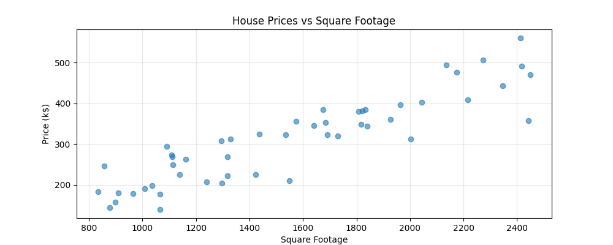

# Linear Regression: Direct Methods

## Notebooks and Slides
- [Lecture slides](slides.pdf)
- [Colab notebook](https://colab.research.google.com/github/damek/STAT-4830/blob/main/section/2/notebook.ipynb)

## Introduction

PyTorch's matrix operations unlock efficient prediction. We'll transform historical data into accurate predictions through three steps: matrix formulation, optimization, and efficient solution. The computational techniques from last lecture prove essential - they determine whether our models run in seconds or hours.

## Prediction with Multiple Features

House prices depend on size, age, bedrooms, and location. A linear model captures these relationships:

$$ \text{price} = w_1 \cdot \text{size} + w_2 \cdot \text{age} + w_3 \cdot \text{bedrooms} + w_4 \cdot \text{location} + \text{noise} $$

Each weight carries clear meaning: $w_1$ measures dollars per square foot, $w_2$ captures price decay with age, and so on. The noise term acknowledges the inherent uncertainty in prices.

Vector notation simplifies this relationship:
$$ y = w^T x + \epsilon $$

Here $y$ represents price, $w$ holds weights, $x$ contains features, and $\epsilon$ captures noise:

```python
house = {
    'size': 1500,     # x₁: sq ft
    'age': 10,        # x₂: years
    'bedrooms': 3,    # x₃: count
    'location': 0.8   # x₄: some score
}
price = 500000  # y: dollars

def predict_price(house, weights):
    """Predict house price using linear combination of features"""
    return (
        weights[0] * house['size'] +      # dollars per sq ft
        weights[1] * house['age'] +       # price change per year
        weights[2] * house['bedrooms'] +  # value per bedroom
        weights[3] * house['location']    # location premium
    )
```

Real estate data validates this linear approach. Individual features often show linear trends with prices, plus scatter that represents our noise term:



Finding optimal weights presents the core challenge. Even reasonable guesses produce significant errors:

```python
# Data in PyTorch tensors
X = torch.tensor([
    [1500, 10, 3, 0.8],  # house 1
    [2100, 2,  4, 0.9],  # house 2
    [800,  50, 2, 0.3]   # house 3
], dtype=torch.float32)
y = torch.tensor([500000, 800000, 250000], dtype=torch.float32)
weights = torch.tensor([200, -1000, 50000, 100000], dtype=torch.float32)

# Make predictions
predictions = X @ weights

# Show individual errors
for i, (pred, actual) in enumerate(zip(predictions, y)):
    error = pred - actual
    print(f"House {i+1}:")
    print(f"  Predicted: ${pred:,.0f}")
    print(f"  Actual:    ${actual:,.0f}")
    print(f"  Error:     ${error:,.0f} ({error/actual:+.1%})\n")

# Compute total error
total_error = torch.sum((predictions - y)**2)
avg_error = torch.sqrt(total_error/len(y))  # Root mean square error
print(f"Total squared error: ${total_error:,.0f}")
print(f"Root mean square error: ${avg_error:,.0f}")
```

Let's visualize these predictions:

```python
plt.figure(figsize=(10, 4))
houses = range(len(y))
plt.bar(houses, y.numpy()/1000, alpha=0.5, label='Actual Price (k$)')
plt.bar(houses, predictions.numpy()/1000, alpha=0.5, label='Predicted Price (k$)')
plt.legend()
plt.title('House Prices: Predicted vs Actual')
plt.show()
```


The squared error quantifies our prediction quality:

$$ \text{error} = \sum_{i=1}^n (y_i - w^T x_i)^2 $$

Squaring serves three purposes:
1. Makes errors positive
2. Penalizes large errors more heavily
3. Creates a smooth optimization landscape

Finding optimal weights requires systematic methods. With millions of houses and hundreds of features, manual tuning fails. Instead, we'll:
1. Use matrix operations for efficient prediction
2. Apply calculus to find optimal weights
3. Solve the resulting equations with linear algebra

