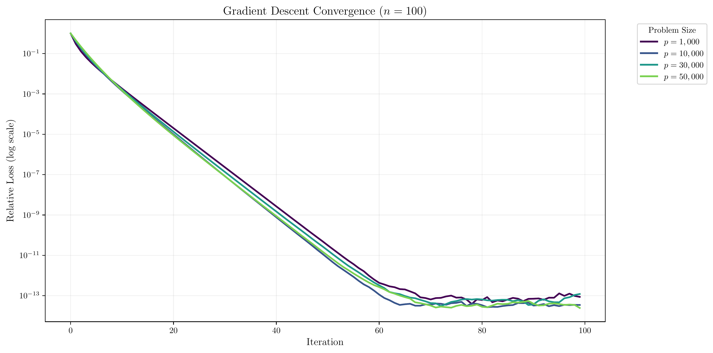
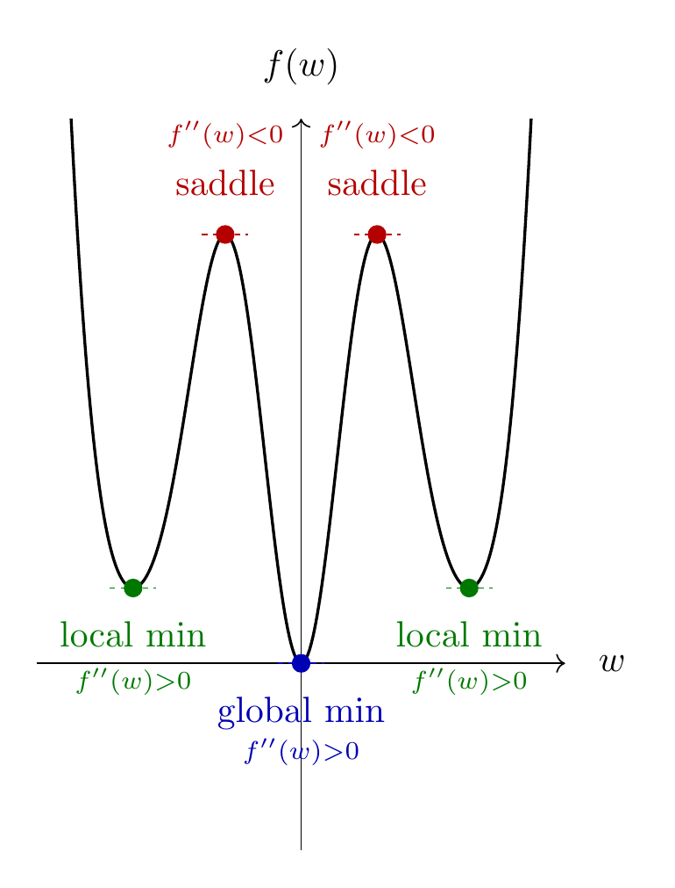
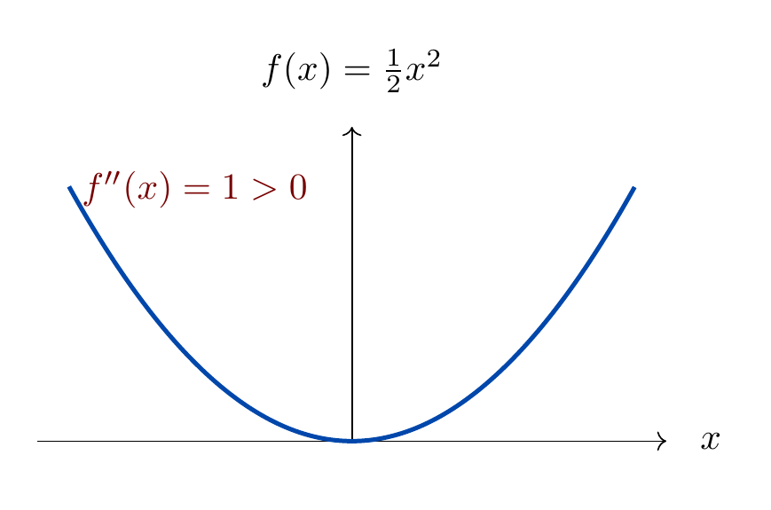
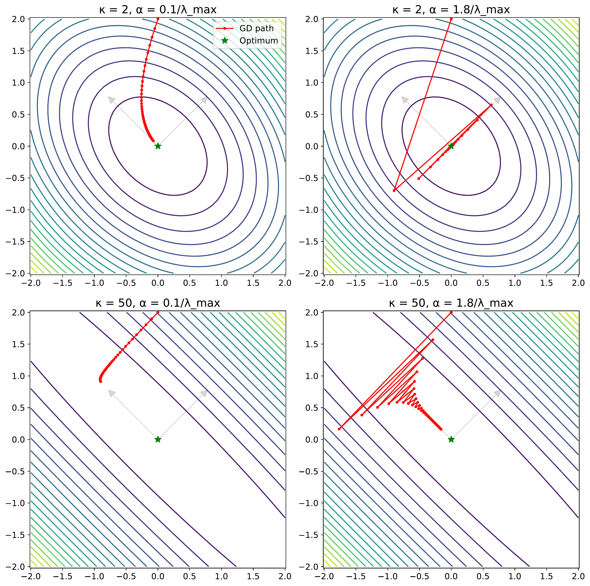

# Linear regression: gradient descent

## Notebooks and Slides
- [Lecture slides](slides.pdf)
- [Colab notebook](https://colab.research.google.com/github/damek/STAT-4830/blob/main/section/3/notebook.ipynb)

## Table of contents
1. [Introduction](#introduction)
2. [The Direction of Steepest Descent](#the-direction-of-steepest-descent)
3. [Gradient Descent in PyTorch](#gradient-descent-in-pytorch)
4. [Practical Considerations](#practical-considerations)
   - [Stepsize Selection](#stepsize-selection)
   - [Convergence Criteria](#convergence-criteria)
   - [The Effect of Condition Number](#the-effect-of-condition-number)
5. [Visualization with Diagonal Matrices](#visualization-with-diagonal-matrices)
6. [Summary and Next Steps](#summary-and-next-steps)

## Introduction

Linear regression forms the foundation of data analysis. It's often the first method you try - if you can't solve a linear regression problem, you likely can't solve anything more complex. Yet even this basic tool hits limitations in modern applications.

Consider genomic prediction: you have blood samples from 1000 patients and measure 100,000 genetic markers for each patient. Your goal? Predict disease risk using linear regression. But you immediately hit a wall:
```python
n_samples = 1000
n_markers = 100_000
memory_needed = (n_markers * n_markers * 8) / (1024**3)  # in GB
print(f"Memory needed for X^TX: {memory_needed:.1f} GB")  # 80.0 GB
```

Just forming the matrix $X^TX$ would exceed most workstations' memory. You can't even start the analysis, let alone solve the resulting system in $O(p^3)$ operations.

This memory wall appears because we're solving a least squares problem with a direct method. Given a data matrix $X \in \mathbb{R}^{n \times p}$ and observations $y \in \mathbb{R}^n$, we seek:

$$ \min_w \frac{1}{2}\|Xw - y\|_2^2 $$

While mathematically elegant, the standard solution requires forming and storing a $p \times p$ matrix - impossible when $p$ is large. Consider medical image reconstruction: converting MRI sensor data into a 3D image with 256³ voxels would require 2.2 petabytes just to store $X^TX$ - that's 0.2% of the world's total data center storage in 2023. 

Even our genomics example, modest by comparison, needs 80GB of RAM on a workstation typically limited to 16-32GB. These aren't edge cases - they're routine analysis tasks. And the problem isn't about buying more RAM or faster processors. The quadratic memory scaling means doubling your problem size requires quadrupling your memory. We need a fundamentally different approach.

### The Memory Wall: Why Direct Methods Fail

Direct methods solve the normal equations $X^TX w = X^Ty$. This transforms our least squares problem into a linear system we know how to solve:
```python
# Direct method (fails for large p)
XtX = X.T @ X           # Form p × p matrix
Xty = X.T @ y          # Form p × 1 vector
w = solve(XtX, Xty)    # Solve p × p system
```

Each step has a cost:
1. Forming X^TX: O(np²) operations and O(p²) memory
2. Forming X^Ty: O(np) operations and O(p) memory
3. Solving system: O(p³) operations

To see these costs in practice, we ran experiments with random matrices - the best-case scenario where numerical issues don't interfere:
```python
X = torch.randn(n, p)      # Well-conditioned random data
w_true = torch.randn(p)    # True solution to recover
y = X @ w_true + 0.1 * torch.randn(n)  # Slight noise
```

The results on a MacBook M1 Pro (64GB RAM) reveal where this approach fails:
```
Size (p)    Memory for X^TX    Time      Status
1,000       8MB               0.005s    Fast, fits in fast memory
5,000       200MB            0.182s    Fits in RAM
20,000      3.2GB            5.209s    RAM stressed
50,000      20GB             FAILS     Out of memory
```

The pattern is clear: memory becomes the bottleneck long before computation time. Even with 64GB of RAM, forming X^TX fails for p=50,000 - not because we lack total memory, but because allocating a contiguous 20GB block for X^TX exceeds system capabilities. The $O(p^3)$ solving cost - roughly $(50,000)^3/3 \approx 42$ trillion floating point operations - becomes irrelevant when we can't even form the matrix. Remember, this is with ideally-conditioned random data - real problems often have worse numerical properties.


This isn't an implementation limitation - it's fundamental to the direct approach. The $O(p^2)$ memory scaling means each significant increase in problem size requires a quadratic increase in contiguous memory allocation. Even high-end workstations with abundant RAM eventually fail when trying to allocate these large matrix blocks. We need a fundamentally different approach.

### A Memory-Efficient Alternative: Gradient Descent

These memory constraints force us to rethink our approach entirely. The key insight? We never need $X^TX$ as a matrix - we only need its action on vectors. Consider what $X^TX$ does:
```python
# This forms a huge p × p matrix (bad)
XtX = X.T @ X           # Need O(p²) memory
result = XtX @ w        # Matrix-vector product

# This does the same computation (good)
Xw = X @ w             # Need O(p) memory
result = X.T @ Xw      # Another O(p) operation
```

Both compute $(X^TX)w$, but the second approach:
- Never forms the $p \times p$ matrix
- Uses $O(np)$ operations (same as first approach)
- Only needs $O(p)$ extra memory for vectors

This insight leads to gradient descent: instead of solving the problem in one step, we:
1. Start with an initial guess (even all zeros)
2. Compute the gradient using matrix-vector products
3. Take a small step in that direction
4. Repeat until convergence

Here's the algorithm in action:
```python
# Gradient descent with matrix-vector products
w = torch.zeros(p)           # Initial guess
for k in range(max_iters):
    Xw = X @ w              # Forward pass: O(np)
    grad = X.T @ (Xw - y)   # Backward pass: O(np)
    w -= step_size * grad   # Update: O(p)
```

The advantages are striking:
1. **Memory**: Only $O(np)$ total, never forms $X^TX$
2. **Operations per step**: $O(np)$, same as one $X^TX$ multiplication
3. **Scalability**: Works even when $X^TX$ would exceed RAM
4. **Flexibility**: Easily modified for different loss functions

This matrix-vector approach is so powerful that it forms the foundation of modern deep learning frameworks. PyTorch uses the same principle - breaking large matrix operations into sequences of matrix-vector products - to train neural networks with millions of parameters. The trade-off is that we need multiple iterations to converge. But as our experiments show, for large problems ($p > 5,000$), the total computation time is often less than direct methods - even before considering memory constraints.

### Convergence Behavior

How quickly does gradient descent converge? Our experiments with random matrices reveal a fascinating pattern:



<!-- need to indicate that relative loss is f(x) - min f(x) -->

The plot shows relative error (current error divided by initial error) versus iteration number. Two key insights emerge:

1. **Linear Convergence**: The error decreases exponentially - appearing as a straight line on the log scale. This is a signature of gradient descent when minimizing quadratic functions like our least squares objective.

2. **Precision vs Time**: While direct methods give exact solutions (up to numerical precision), gradient descent offers a precision-time tradeoff:
   - 20 iterations: ~$10^{-5}$ relative error
   - 40 iterations: ~$10^{-9}$ relative error
   - 60 iterations: ~$10^{-13}$ relative error
Each doubling of iterations improves precision by about $10^4$ (four orders of magnitude).

This behavior, while observed here on random matrices, makes gradient descent remarkably effective: we get predictable convergence and can estimate iterations needed for desired precision. But why does this work? Why does following the negative gradient lead to the solution? To understand this - and to tackle practical challenges like stepsize selection and ill-conditioning - we need to explore the concept of steepest descent.

## The Direction of Steepest Descent

Gradient descent works by repeatedly asking a simple question: if we can only move in one direction, which direction gives us the most improvement per unit step? This leads us to the concept of steepest descent.

### The Least Squares Landscape

Our least squares objective measures the squared prediction error:

$$ f(w) = \frac{1}{2}\|Xw - y\|_2^2 = \frac{1}{2}(Xw - y)^\top(Xw - y) $$

The $\frac{1}{2}$ is for convenience - it will cancel the 2 that appears when we take derivatives. Expanding this reveals its quadratic structure:

$$ f(w) = \frac{1}{2}(w^\top X^\top X w - 2y^\top X w + y^\top y) $$

Each term tells a geometric story: $w^\top X^\top X w = \|Xw\|^2$ measures how large our predictions are, $2y^\top X w$ measures their alignment with the truth, and $y^\top y$ is a constant measuring the scale of our target values.

To find the gradient, we need the partial derivatives with respect to each component of $w$. For any component $w_j$:

$$ \begin{aligned}
\frac{\partial f}{\partial w_j} &= \frac{\partial}{\partial w_j} \left[\frac{1}{2}(Xw - y)^\top(Xw - y)\right] \\
&= \frac{\partial}{\partial w_j} \left[\frac{1}{2}\sum_{i=1}^n (x_i^\top w - y_i)^2\right] \\
&= \sum_{i=1}^n (x_i^\top w - y_i)x_{ij}
\end{aligned} $$

Collecting these partial derivatives into a vector gives us the gradient. The $j$-th component sums over all observations $i$, weighting the prediction error $(x_i^\top w - y_i)$ by the feature value $x_{ij}$. In matrix form, this is exactly (if you don't see it, check!):

$$ \nabla f(w) = X^\top(Xw - y) = X^\top X w - X^\top y $$

This gradient has a beautiful interpretation: $Xw-y$ is our prediction error in the output space, and $X^\top$ "projects" this error back into the parameter space, telling us how to adjust each parameter to reduce the error.

### Finding the Best Direction

At any point $w$, we want to find the direction $v$ that decreases $f(w)$ most rapidly. For quadratic functions like ours, we can compute the exact change in value when moving in direction $v$:

$$ \begin{aligned}
f(w + \epsilon v) &= \frac{1}{2}\|X(w + \epsilon v) - y\|_2^2 \\
&= \frac{1}{2}(Xw + \epsilon Xv - y)^\top(Xw + \epsilon Xv - y) \\
&= \frac{1}{2}\big((Xw - y)^\top(Xw - y) + 2\epsilon(Xw - y)^\top Xv + \epsilon^2v^\top X^\top Xv\big) \\
&= f(w) + \epsilon(Xw - y)^\top Xv + \frac{\epsilon^2}{2}v^\top X^\top Xv \\
&= f(w) + \epsilon \nabla f(w)^\top v + \frac{\epsilon^2}{2}v^\top X^\top X v
\end{aligned} $$

where we used our previous calculation that $\nabla f(w) = X^\top(Xw - y)$. 

For small $\epsilon$, we can approximate the change in $f$ using just the linear term:

$$ f(w + \epsilon v) \approx f(w) + \epsilon \nabla f(w)^\top v $$

This first-order approximation determines the initial rate of descent. Our goal is to find the unit vector $v$ that decreases $f$ most rapidly in this linear approximation. In other words, we want to solve:

$$\mathrm{minimize } \; \nabla f(w)^\top v \quad \mathrm{subject \ to} \quad \|v\| = 1. $$

Note that this is the first optimization problem we've formally written down in this course. You can see it has two components:

1. A function to minimize: $h(v) := \nabla f(w)^\top v$
2. A constraint: $\|v\| = 1$

We'll see more examples of these throughout the course, but for now, let's solve this problem.

This minimization has a geometric interpretation: the dot product $\nabla f(w)^\top v$ measures how much $v$ points in the direction of the gradient. We want the most negative possible value of this projection. The solution turns out to be:

$$v_\star = -\frac{\nabla f(w)}{\|\nabla f(w)\|}$$

To prove this is optimal, we use the Cauchy-Schwarz inequality. For any unit vector $v$:

$$ |\nabla f(w)^\top v| \leq \|\nabla f(w)\| \|v\| = \|\nabla f(w)\| $$

Since $\\|v\\| = 1$, this tells us that $\nabla f(w)^\top v$ can't be smaller than $-\\|\nabla f(w)\|$

This lower bound is crucial: it tells us that no unit vector can achieve a value of $\nabla f(w)^\top v$ smaller than $-\|\nabla f(w)\|$. When $v = v_\star = -\nabla f(w)/\|\nabla f(w)\|$, we achieve exactly this lower bound:
$$ \nabla f(w)^\top v_\star = -\|\nabla f(w)\| $$

This proves that $v_\star$ solves our minimization problem - it is literally the direction of steepest descent. Any other direction would make a larger angle with $-\nabla f(w)$, resulting in a smaller rate of descent.

### The Geometry of Steepest Descent

To minimize our function, we need to answer a simple question at each step: which direction should we move? Below, the gray ellipses show level sets of $f$ - points where $f(w)$ has the same value. For our quadratic function, these are  ellipses because $f(w) = c$ defines a quadratic form in $w$. Their nested structure reveals how the function changes as we move through the parameter space - where level sets bunch together, the function changes rapidly, and the gradient is large.


At any point $w$, the gradient $\nabla f(w)$ (blue arrow) points perpendicular to the level set, in the direction of steepest increase. This perpendicularity has a beautiful geometric meaning - since points along the level set have the same value, the direction of maximum change must point directly away from the level set. The negative gradient $-\nabla f(w)$ (red arrow) therefore points in the direction of steepest descent. This is a geometric restatement of what we proved above.

Any other direction $v$ (gray arrow) can be understood through its angle $\theta$ with $-\nabla f(w)$. The more $v$ deviates from the negative gradient direction, the more it points along rather than across level sets, and the slower our descent becomes. Only by moving perpendicular to the level sets do we take the most direct path downhill.

This geometry suggests a natural algorithm: repeatedly step in the direction of steepest descent. At each point, we compute the gradient, move opposite to it, and reach a new point with lower function value. The path this creates crosses level sets at right angles, following the most direct route downhill at each step.

### What happens when the gradient is zero?

When the gradient vanishes, something remarkable happens: we've found a point where we can't improve by moving in any direction. For our least squares problem, this means we've found $w$ where $X^\top(Xw - y) = 0$ - exactly the normal equations we derived earlier. Geometrically, we're at a point where the level sets have no "tilt" - every direction looks flat to first order.

This principle extends far beyond least squares. When the gradient of any function $f$ is zero, we've found what mathematicians call a first-order critical point or stationary point. The name captures the geometry: the function has stopped changing (to first order) in every direction, just as a ball at rest on a surface has no tendency to roll in any direction. This is precisely what you learned about minimizers in calculus - the gradient must vanish at any local minimum.



But not every critical point is a minimum - think of a ball balanced on a hill (a maximum) or resting at a saddle point. To guarantee we've found a minimum, we need to examine the second derivatives. In multiple dimensions, these form the Hessian matrix, which measures the local curvature in every direction. When the Hessian is positive definite (all eigenvalues positive), every direction curves upward, and we've found a local minimum.

Our least squares problem has an even nicer structure. The Hessian $X^\top X$ is positive semidefinite everywhere - it's the same matrix at every point, with eigenvalues that are always nonnegative. (See the figure below for a one-dimensional example.) This positive curvature explains the elliptical level sets we saw earlier and is a signature of convex functions, where every local minimum must be a global minimum.We'll explore convexity in detail later, but for now, we have a powerful guarantee: when gradient descent finds a point where the gradient vanishes, we've solved our problem completely.



## The Algorithm

This geometric understanding leads naturally to gradient descent. At each step:
1. Start at our current point $w_k$
2. Compute the gradient $g_k = X^\top X w_k - X^\top y$
3. Move in the negative gradient direction: $w_{k+1} = w_k - \alpha_k g_k$
4. Repeat until the gradient becomes small

Three key factors determine the algorithm's success. First, the stepsize $\alpha_k$ controls our progress. Too small and we inch forward, wasting computation. Too large and we overshoot, potentially increasing the objective value. For quadratic functions like least squares, the optimal stepsize is related to the eigenvalues of $X^\top X$. Specifically, convergence is guaranteed when:

$$ 0 < \alpha_k < \frac{2}{\lambda_{\max}(X^\top X)} $$

where $\lambda_{\max}$ is the largest eigenvalue. This connects beautifully to our geometric picture - the eigenvalues determine the shape of the level sets, and the largest eigenvalue determines how far we can safely step.


The figure illustrates why the stepsize bound depends on $\lambda_{\max}$. For any level set where $f(w) = c$, it can be shown that $\|\nabla f(w)\| \leq \sqrt{2\lambda_{\max}c}$. The width of the level sets varies with both the value of $c$ and the eigenvalues: the narrowest width (shown by the vertical arrow) is $2\sqrt{\frac{2c}{\lambda_{\max}}}$ - this occurs in the direction of the eigenvector corresponding to $\lambda_{\max}$, while the widest width is $2\sqrt{\frac{2c}{\lambda_{\min}}}$ in the direction of the smallest eigenvalue. Taking too large a step (shown by the "overshooting" path) moves us outside the current level set and potentially increases the objective value. The "safe step" stays within a region where our linear approximation remains valid. This geometric insight explains why we need smaller steps when $\lambda_{\max}$ is large - the level sets become very narrow in their thinnest direction, requiring more careful progress to avoid overshooting.

Second, the condition number of $X^\top X$ affects convergence speed. When all eigenvalues are similar (condition number near 1), the level sets are nearly circular, and we progress steadily toward the minimum. But when eigenvalues differ greatly, the level sets become highly elongated ellipses with the ratio of widths determined by $\sqrt{\lambda_{\max}/\lambda_{\min}}$, forcing the algorithm to zigzag its way down a narrow valley. This geometric picture explains why poorly conditioned problems converge slowly. We'll see this zigzagging behavior clearly illustrated in the convergence plots below, where high condition numbers force the algorithm to take an inefficient meandering path to the solution.

Third, our initial guess $w_0$ matters. While gradient descent will eventually find the minimum for any starting point (thanks to convexity), a good initial guess can dramatically reduce the number of iterations needed. For least squares, starting at zero is often reasonable since it gives zero predictions - a natural baseline.

## Implementation

Let's implement gradient descent to see these factors in action. Our implementation will explicitly compute gradients using matrix-vector products to maintain memory efficiency:

```python
def gradient_descent(X, y, n_steps=100, step_size=0.01):
    # Initialize weights
    w = torch.zeros(X.shape[1])
    
    # Cache only X^T y, not X^T X
    Xty = X.T @ y
    
    # Compute optimal value for relative loss
    w_opt = torch.linalg.lstsq(X, y).solution
    f_opt = 0.5 * ((X @ w_opt - y)**2).sum()
    f_init = 0.5 * ((X @ w - y)**2).sum()
    
    losses = []
    for step in range(n_steps):
        # Compute gradient in two steps to avoid forming X^T X
        Xw = X @ w
        grad = X.T @ (Xw - y)
        
        # Take step in negative gradient direction
        w = w - step_size * grad
        
        # Track relative loss
        f_curr = 0.5 * ((X @ w - y)**2).sum()
        rel_loss = (f_curr - f_opt)/(f_init - f_opt)
        losses.append(rel_loss.item())
    
    return w, losses
```

This implementation reveals several practical considerations. First, we compute gradients using two matrix-vector products ($Xw$ then $X^T (Xw - y)$) instead of forming $X^T X$. This maintains $O(np)$ memory usage, crucial for large-scale problems. Second, we track the relative loss $(f(w) - f*)/(f(w_0) - f^*)$ to monitor convergence independent of problem scale.

Let's visualize how these factors affect convergence. We'll create test problems with different condition numbers and compare their convergence paths:


The plots reveal key insights about gradient descent. The left plot shows how stepsize affects convergence when κ=10: small steps (α=0.1/λ_max) give steady but slow progress, while large steps (α=1.8/λ_max) can initially make rapid progress but risk overshooting. The right plot demonstrates how condition number impacts convergence: well-conditioned problems (κ=2) converge quickly in a direct path, while poorly conditioned problems (κ=100) require many iterations, zigzagging their way to the solution.

The interplay between stepsize and condition number becomes particularly clear when we visualize the optimization paths in 2D:



The contour plots show level sets of the objective function for different combinations of condition number (κ) and stepsize (α). When κ=2 (top row), the level sets are nearly circular. With a small stepsize (α=0.1/λ_max), we make steady but slow progress. A larger stepsize (α=1.8/λ_max) converges faster but shows slight oscillation. When κ=50 (bottom row), the level sets become highly elongated. Now the stepsize choice becomes crucial: small steps make slow but steady progress, while large steps cause dramatic zigzagging as the algorithm bounces between the walls of the narrow valley. This geometric view explains why high condition numbers demand more careful stepsize selection - we must balance the need for progress in the well-conditioned direction against the risk of overshooting in the poorly conditioned direction.

Later, we'll see how PyTorch's automatic differentiation can simplify this implementation, especially for more complex objective functions. But the core ideas - following the negative gradient with appropriate stepsize - remain the same.

## Conclusion

We have much left to learn about gradient descent which like direct methods for least squares problems has limitations. For example, for large n or p, our $O(np)$ memory implementation fails. When n is large, computing the full gradient becomes too expensive - we need stochastic methods that estimate gradients from subsets. When p is large, coordinate descent methods that update parameters sequentially work better. We'll cover these variants later in the course. I started with least squares to get you using gradient descent quickly.

Next we'll study optimization problems in data science and machine learning. We'll write them down precisely and implement them in PyTorch. You'll see how to use autodifferentiation in practice, though we'll save the theory of why it works for later in the course.

